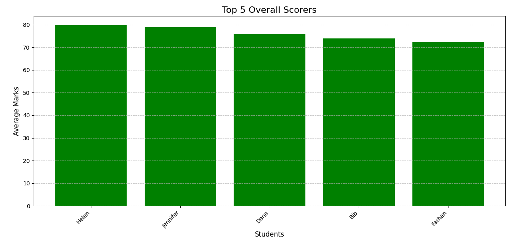
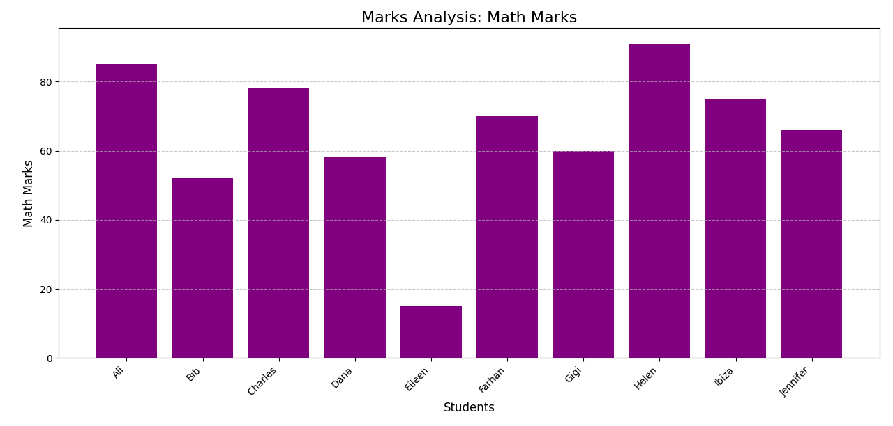
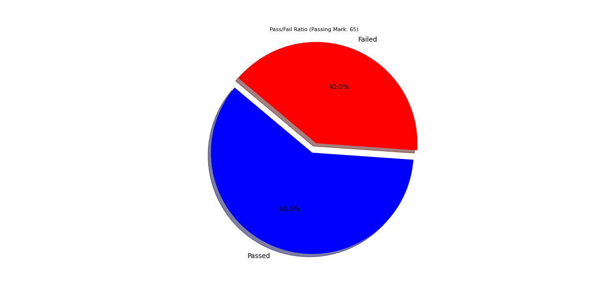

# Student Data Organizer & Analyzer

## Quick Overview
Python project designed to organize, analyze, and visualize student academic performance data.


## Tech Stack
* Python 3.9+
* Pandas 1.3+ (https://pandas.pydata.org/) -library for data manipulation and analysis
* Matplotlib 3.5+ (https://matplotlib.pydata.org/) - a python 2D plotting library
* CSV Processing - structured data handling

## Technical Implementation
  
### Core Architecture
- **Data Processing Pipeline**: CSV → Pandas DataFrame → Statistical Analysis → Visualization
- **Modular Design**: Three separate analysis modules for different insights
- **Clean Data Assumption**: Designed for well-formatted CSV input

### Key Components
- **Data Loader**: Efficient CSV parsing with pandas.read_csv()
- **Statistical Engine**: Mean calculations, ranking algorithms, pass/fail logic
- **Visualization Layer**: Matplotlib charts with customizable styling
- **Output Generator**: Multiple chart types (bar, pie)


## Sample Outputs

### 1. Top 5 Students Performance

*Bar chart showing highest-performing students with average marks across all subjects*

### 2. Subject-Wise Analysis  

*Individual subject performance analysis with comparative student rankings*

### 3. Pass/Fail Distribution

*Pie chart visualization showing overall class performance with 65% passing threshold*


## Quick Start

### Setup (Local Environment)
1. **Clone this repository:**
    ```bash
    git clone [https://github.com/qula4/student-data-analyzer.git](https://github.com/qula4/student-data-analyzer.git)
    ```

2. **Navigate into the project directory:**
    ```bash
    cd student-data-analyzer
    ```
3. **Create a virtual environment (recommended):**
    ```bash
    python -m venv venv
    ```
4. **Activate the virtual environment:**
    * **On Windows (PowerShell):**
        ```bash
        . .\venv\Scripts\activate
        ```
    * **On Windows (Command Prompt):**
        ```bash
        .\venv\Scripts\activate.bat
        ```
5. **Install the required packages:**
    ```bash
    pip install -r requirements.txt
    ```

### Running the Script
  Ensure you are in the project's root directory ('student-data-analyzer') with the virtual environment activated.
You can run the different analysis scripts as follows:
1. **To analyze top performers scorers:**
    ```bash
    python top_scorers_analysis.py 
    ```
2. **To analyze subject-specific marks:**
     ```bash
    python sub_marks_analysis.py 
    ```
3. **To calculate pass\fail ratio:**
      ```bash
    python pass_fail_ratio.py 
    ```


## Complete Project Documentation
For detailed technical implementation, code analysis, and comprehensive project overview, see the [complete project report](./student-data-analyzer.pdf).
<!-- end list -->
    [Download Full Project Report (PDF)](./student-data-analyzer.pdf)


**Built with Python • Pandas • Matplotlib**
